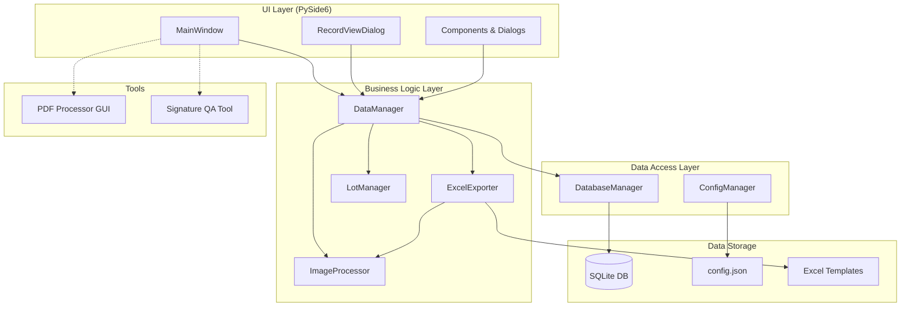
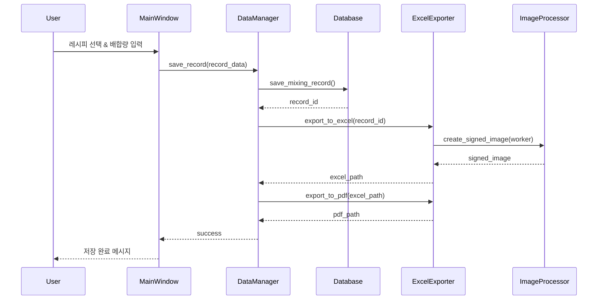
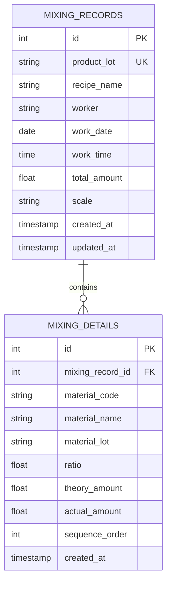

# 시스템 아키텍처 설계

> **Summary**: 배합 프로그램 v3 시스템 아키텍처 설계 문서
>
> **Author**: AI Assistant  
> **Created**: 2026-01-31  
> **Status**: In Progress

---

## 시스템 개요

### 목적

제조 현장에서 원료 배합 작업을 관리하고, 배합 기록을 체계적으로 저장하며, 실적서를 자동으로 생성하는 데스크톱 애플리케이션

### 주요 사용자

- 제조 현장 작업자
- 품질 관리 담당자
- 생산 관리자

### 핵심 기능

1. **배합 관리**: 레시피 기반 원료 배합 및 기록
2. **실적서 생성**: Excel/PDF 자동 출력 (서명 합성 포함)
3. **기록 관리**: 데이터베이스 기반 배합 이력 관리
4. **PDF 품질 제어**: 스캔 효과 적용, 서명 QA
5. **Google Sheets 백업**: 자동 클라우드 백업 (선택적)

---

## 아키텍처 다이어그램

### 레이어 구조

### 데이터 흐름

---

## 모듈 구조

### UI Layer (`ui/`)

#### `main_window.py`

- **역할**: 메인 사용자 인터페이스
- **주요 기능**:
  - 레시피 선택
  - 배합량/자재 LOT 입력
  - 날짜/시간 선택
  - PDF 스캔 효과 설정
  - 배합 기록 저장/출력
  - 기록 조회

#### `components.py`

- **역할**: 재사용 가능한 UI 컴포넌트
- **제공 컴포넌트**:
  - `StyledButton`: 테마별 버튼
  - `FormField`: 폼 입력 필드
  - `DataTableWidget`: 데이터 테이블

#### `dialogs/`

- `record_view_dialog.py`: 배합 기록 조회 및 관리
- `google_sheets_settings_dialog.py`: Google Sheets 설정
- `lot_selection_dialog.py`: LOT 선택
- `recipe_manager_dialog.py`: 레시피 관리

#### `styles.py`

- **역할**: 통합 스타일 시스템
- **제공 스타일**: 버튼, 입력 필드, 테이블, 탭 등

---

### Business Logic Layer (`models/`)

#### `data_manager.py`

- **역할**: 중앙 데이터 관리 레이어
- **주요 메서드**:
  - `load_recipes()`: 레시피 로드
  - `save_record()`: 배합 기록 저장
  - `export_existing_record()`: 저장된 기록 재출력
  - `delete_record()`: 기록 삭제
  - `get_all_material_names()`: 품목 목록 조회
  - `get_total_amount_for_item()`: 품목별 집계

#### `database.py`

- **역할**: SQLite 데이터베이스 관리
- **주요 메서드**:
  - `init_database()`: DB 초기화
  - `save_mixing_record()`: 배합 기록 저장
  - `get_mixing_records()`: 기록 조회
  - `get_mixing_record_by_lot()`: LOT으로 조회
  - `delete_mixing_record()`: 기록 삭제

#### `excel_exporter.py`

- **역할**: Excel/PDF 출력
- **주요 메서드**:
  - `export_to_excel()`: Excel 생성
  - `export_to_pdf()`: PDF 변환 (스캔 효과 포함)
  - `_apply_scan_effects()`: PDF 스캔 효과 적용

#### `image_processor.py`

- **역할**: 서명 이미지 처리
- **주요 메서드**:
  - `create_signed_image()`: 서명 합성 이미지 생성
  - `_load_base_image()`: 베이스 이미지 로드
  - `_load_signature()`: 서명 이미지 로드
  - `_enhance_signature()`: 서명 강화 (업샘플, 블러, 대비 등)

#### `lot_manager.py`

- **역할**: LOT 번호 생성 및 관리
- **LOT 형식**: `{레시피코드}{날짜8자리}{일련번호2자리}`
- 예: `APB2511160301` (APB, 2025-11-16, 01번)

---

### Data Access Layer

#### `config/settings.py`

- **역할**: 환경 및 경로 설정
- **주요 기능**:
  - PyInstaller 패키징 환경 대응 (`sys.frozen`)
  - 한글 경로 처리
  - 출력 폴더 자동 폴백

#### `config/config_manager.py`

- **역할**: JSON 기반 런타임 설정 관리
- **주요 속성**:
  - `workers`: 작업자 목록
  - `scan_effects`: PDF 스캔 효과 파라미터
  - `fonts`, `window_size`: UI 설정
  - `poppler_path`: Poppler 경로

#### `config/google_sheets_config.py`

- **역할**: Google Sheets 백업 설정
- **주요 기능**:
  - 서비스 계정 인증
  - 스프레드시트 URL 관리
  - 백업 옵션 설정

---

### Utilities (`utils/`)

#### `logger.py`

- **역할**: 통합 로깅 시스템
- **로그 레벨**: DEBUG, INFO, WARNING, ERROR, CRITICAL
- **출력**: 파일 (`logs/mixing_program.log`), 콘솔
- **특수 메서드**: `log_mixing_operation()` - 배합 작업 전용 로깅

#### `error_handler.py`

- **역할**: 예외 처리 및 유효성 검사
- **주요 기능**:
  - `@handle_exceptions`: 예외 처리 데코레이터
  - `validate_mixing_ratio()`: 배합 비율 검증
  - `show_error_message()`: 에러 메시지 표시

---

### Tools

#### `pdf_processor_gui/`

- **목적**: PDF 처리 및 미리보기 도구
- **구조**:
  - `main.py`: GUI 진입점
  - `processing/converter.py`: PDF ↔ 이미지 변환
  - `ui/main_window.py`: 처리 UI

#### `signature_qa_tool/`

- **목적**: 서명 이미지 품질 검증
- **구조**:
  - `main.py`: QA 도구 진입점
  - `processing/generator.py`: 테스트 서명 생성
  - `ui/main_window.py`: QA UI

---

## 데이터 모델

### mixing_records (배합 기록 테이블)

| 컬럼         | 타입      | 설명          | 비고              |
| ------------ | --------- | ------------- | ----------------- |
| id           | INTEGER   | 기본 키       | AUTO INCREMENT    |
| product_lot  | TEXT      | 제품 LOT 번호 | 예: APB2511160301 |
| recipe_name  | TEXT      | 레시피명      | 예: APB           |
| worker       | TEXT      | 작업자        | 예: 김민호        |
| work_date    | TEXT      | 작업일자      | YYYY-MM-DD        |
| work_time    | TEXT      | 작업시간      | HH:MM:SS          |
| total_amount | REAL      | 총 배합량 (g) |                   |
| scale        | TEXT      | 사용 저울     | 예: M-65          |
| created_at   | TIMESTAMP | 생성일시      |                   |
| updated_at   | TIMESTAMP | 수정일시      |                   |

### mixing_details (배합 상세 테이블)

| 컬럼             | 타입      | 설명            | 비고                        |
| ---------------- | --------- | --------------- | --------------------------- |
| id               | INTEGER   | 기본 키         | AUTO INCREMENT              |
| mixing_record_id | INTEGER   | 배합 기록 FK    | ON DELETE CASCADE           |
| material_code    | TEXT      | 자재 코드       | 예: PB                      |
| material_name    | TEXT      | 자재명          | 예: Prepolymer              |
| material_lot     | TEXT      | 자재 LOT        | 사용자 입력                 |
| ratio            | REAL      | 배합 비율 (%)   | 100% 기준                   |
| theory_amount    | REAL      | 이론 배합량 (g) | ratio × total_amount        |
| actual_amount    | REAL      | 실제 배합량 (g) | = theory_amount (자동 입력) |
| sequence_order   | INTEGER   | 배합 순서       | 정렬용                      |
| created_at       | TIMESTAMP | 생성일시        |                             |

### 관계

---

## 주요 워크플로우

### 1. 배합 기록 생성 흐름

1. **사용자 입력**:
   - 레시피 선택
   - 배합량 입력 (100g 단위)
   - 작업 날짜/시간 선택
   - 각 자재의 LOT 번호 입력

2. **데이터 검증**:
   - 모든 LOT 번호 입력 확인
   - 배합 비율 합계 검증 (허용 오차 ±5%)

3. **데이터 저장**:
   - `mixing_records` 테이블에 기본 정보 저장
   - `mixing_details` 테이블에 자재별 상세 정보 저장

4. **실적서 생성**:
   - Excel 생성 (템플릿 기반)
   - 서명 이미지 합성
   - PDF 변환 (스캔 효과 적용)

### 2. 실적서 출력 흐름 (Excel → PDF)

1. **Excel 생성**:
   - 템플릿 로드 (`resources/template.xlsx`)
   - 셀 매핑으로 데이터 입력
   - 서명 이미지 삽입

2. **PDF 변환**:
   - Excel → 임시 PDF (win32com)
   - PDF → 이미지 (pdf2image)
   - 스캔 효과 적용 (블러, 노이즈, 대비, 밝기)
   - 이미지 → 최종 PDF (Pillow)

### 3. 서명 합성 프로세스

1. **베이스 이미지 로드**: 서명 배경 이미지
2. **서명 이미지 로드**: 작업자별 서명 파일
3. **서명 강화**:
   - 고해상도 업샘플링 (LANCZOS)
   - 알파 채널 처리 (가우시안 블러, MaxFilter, MinFilter)
   - 압력 노이즈 추가
   - 대비 강화
4. **합성**: 베이스 이미지에 서명 오버레이
5. **최종 처리**: 선명도 향상 및 다운샘플링

---

## 보안 고려사항

### 데이터 보안

- SQLite DB 파일 로컬 저장 (암호화 미적용)
- Google Sheets 서비스 계정 JSON은 배포 제외

### 인증/권한

- 현재: 단일 사용자 환경 (작업자 선택식)
- 향후: 로그인 시스템 고려 가능

---

## 성능 고려사항

### 최적화 영역

- PDF 변환 시 이미지 해상도 조절 (200-300 DPI)
- 대량 기록 조회 시 페이지네이션 고려
- 서명 이미지 캐싱 (동일 작업자 반복 사용 시)

### 리소스 관리

- Excel COM 객체 명시적 해제
- 임시 파일 자동 정리
- 로그 파일 로테이션 (일별)

---

## 향후 확장 방향

### Phase 2 (계획)

- 웹 기반 인터페이스
- REST API 제공
- 실시간 알림 시스템

### Phase 3 (계획)

- 클라우드 동기화
- 모바일 앱 연동
- AI 기반 배합 최적화

---

**작성일**: 2026-01-31  
**버전**: 1.0  
**상태**: In Progress
